## Hands On Work
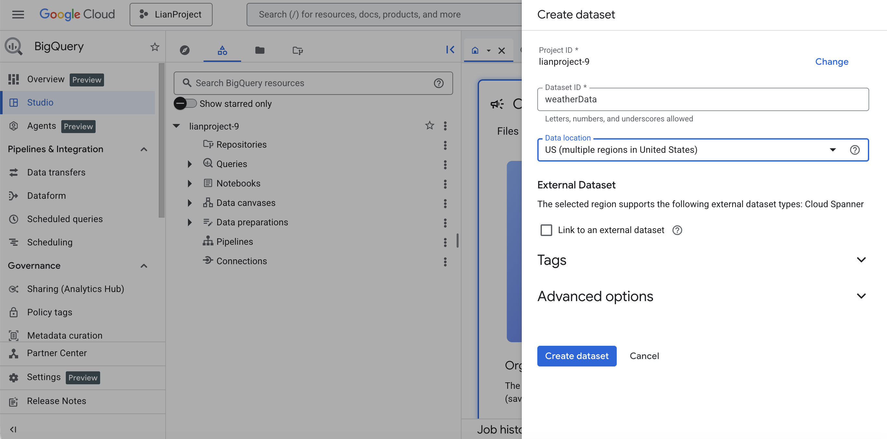
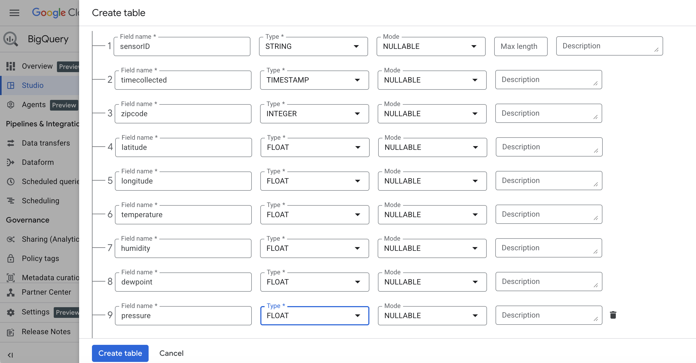
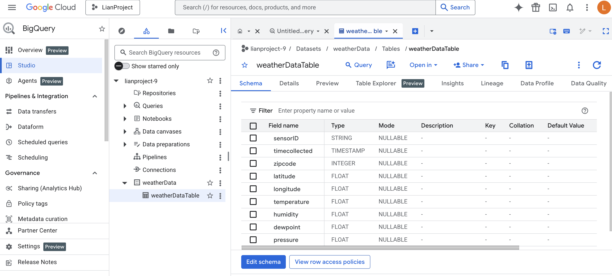
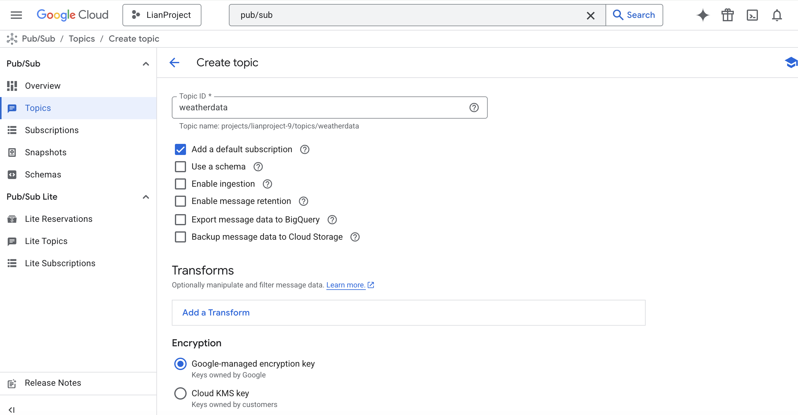
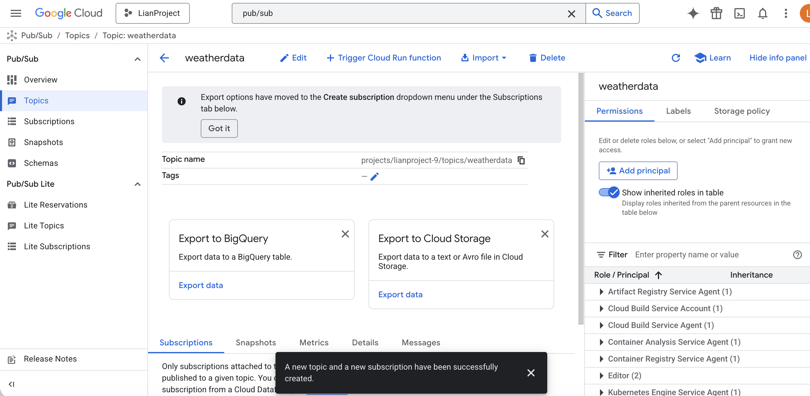
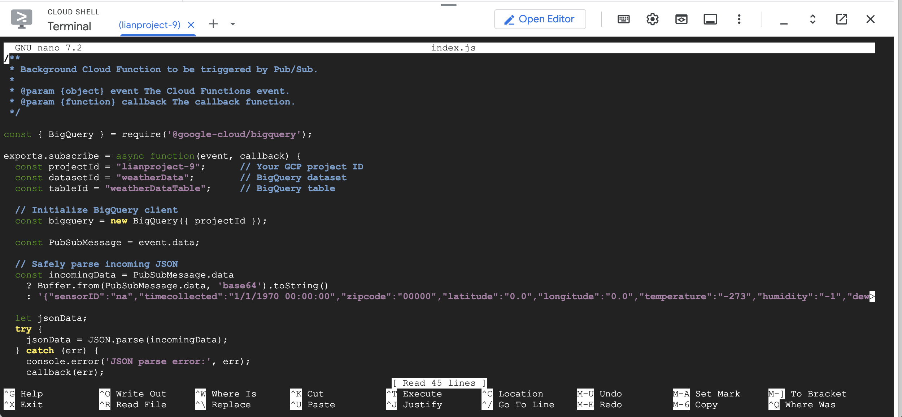
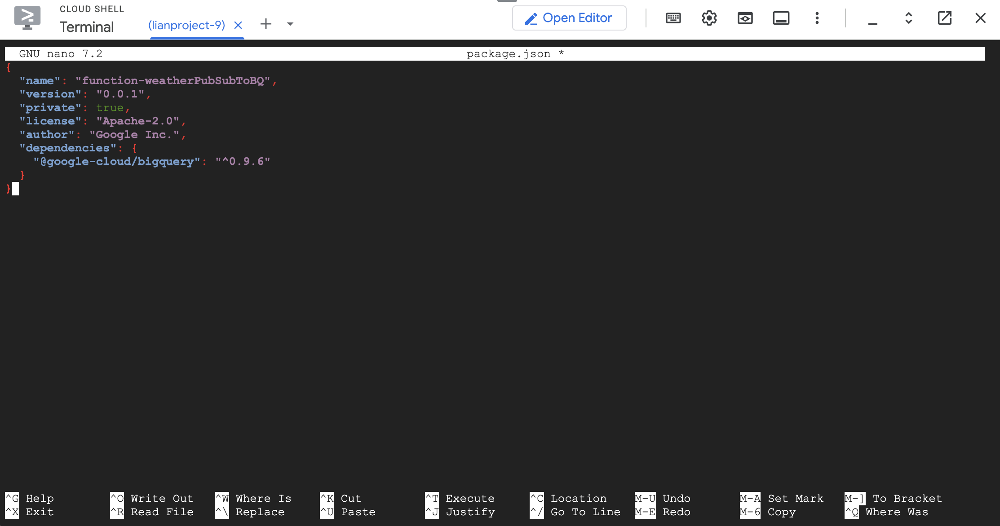
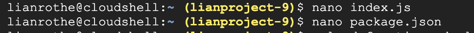
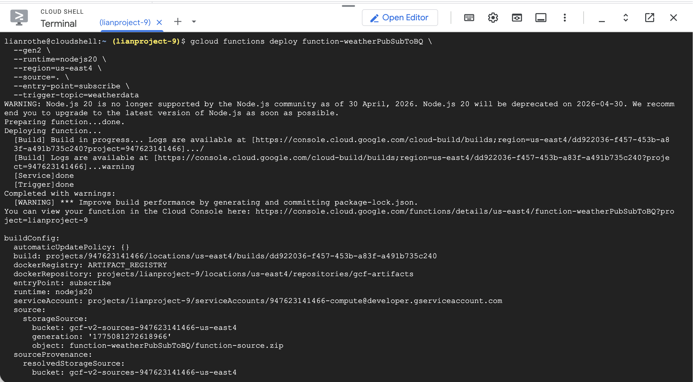
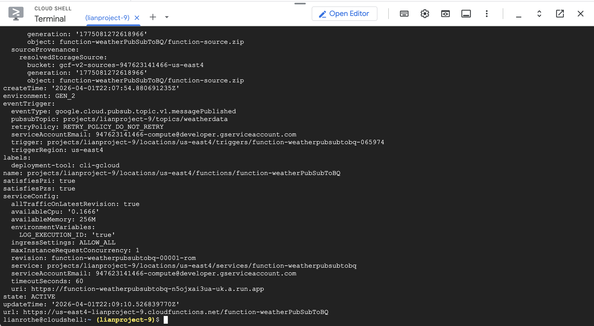
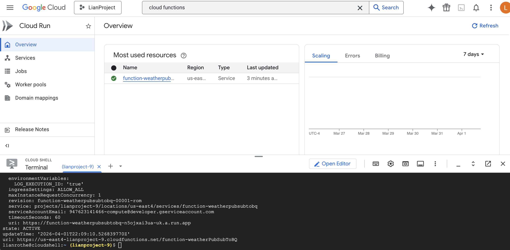
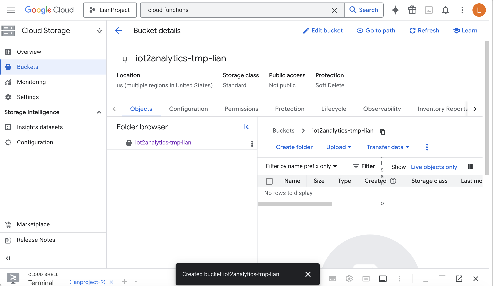
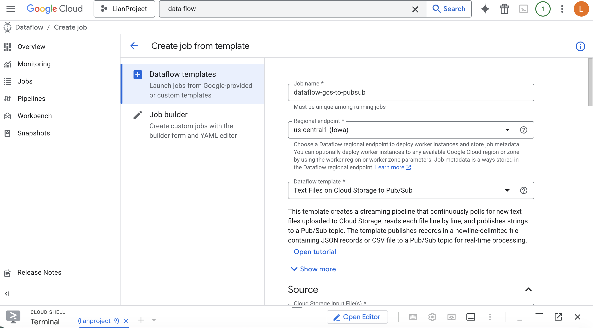
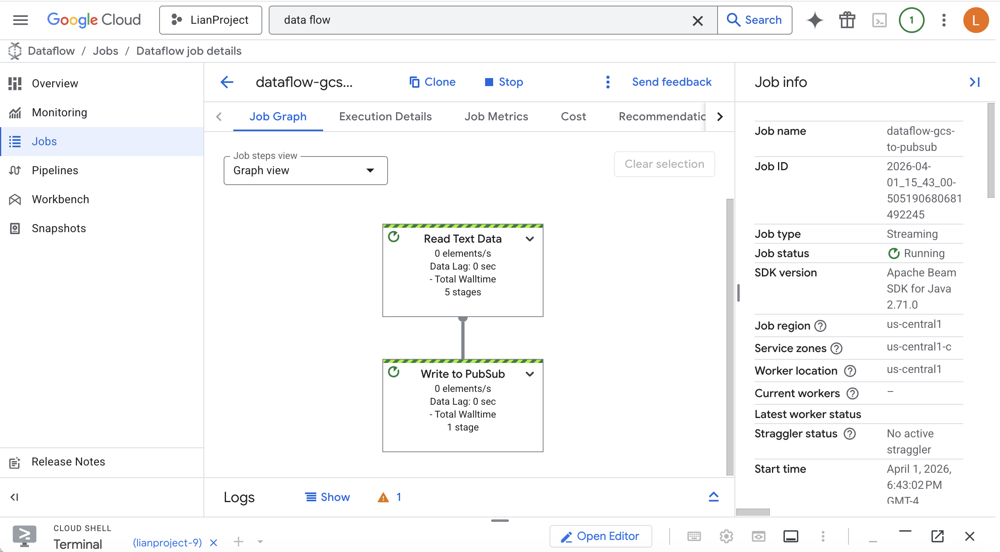
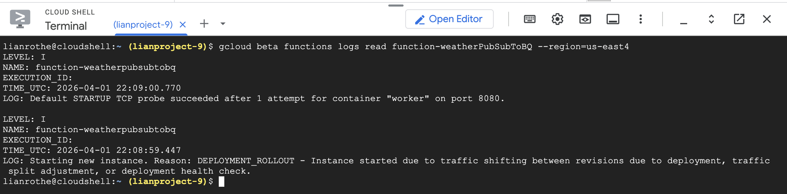
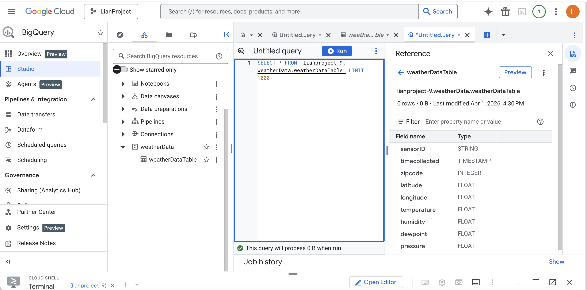

### Analysis
This codelab gave guided steps on how to build a serverless IoT to Analytics data pipeline on GCP. This was done by creating a Pub/Sub topic (weatherdata) as the message broker. That was done when the Cloud Function was deployed, triggered by Pub/Sub, which writes to BigQuery. The IoT device was simulated by publishing JSON sensor data. The architecture that was investigated involves many different concepts. The Pub/Sub works as a decoupled message bus, this means that the publisher does not have any knowledge of the consumer. The Cloud Function scales to zero when idle which shows an event triggered compute that invokes per message. The JSON file contents works as an implicit domain boundary between the producer and consumer representing a schema as contract.
Spotify uses squads to organize its teams so that each owns its own specific domain such as a playlist, discovery, podcasts. Then each squad gets its own Pub/Sub topic, this is how they publish events without coupling downstream. The internal event delivery system that Spotify uses is the same method as the codelab just on a larger scale. The domain ownership is navigated through the other squads subscribing to the topic schema, creating a system where they do not directly talk to each other. This is used in Spotify for playback events, user activity streams, recommendations, or ads.
Independent scaling per domain team is possible because Pub/Sub decouples the producers and consumers while unfortunately adding operational overhead. The Cloud Functions reduces infra burden but it can complicate tracing, as a way to compensate for this Spotify layers observability tooling. The take away from this is that Spotify enforces schema through internal tooling because Pub/Sub is not enough. Keeping loose coupling and single responsibility helps to ensure a successful architecture.
When the dataflow simulator publishes a JSON message to the Pub/Sub topic (weatherdata) The Cloud Function works automatically and independently. The Cloud Function can be deleted and redeployed without touching the publisher, only the topic is shared. A direct example to Spotify would be if a user skips a song before 30 seconds. When this happens Spotify's Playback squad publishes a track-skip event to their internal Pub/Sub topic. After that multiple independent subscribers react to the event, without the Playback squad knowing. From here, recommendations and analytics are able to be updated.
To explore past the code lab a modification was done to publish a custom test message manually to the Pub/Sub topic through the Console. Doing this acts a second independent producer with the same topic, showing how a second Spotify squad would publish to the same event without needing to communicate with the original publisher. 

### Diagram
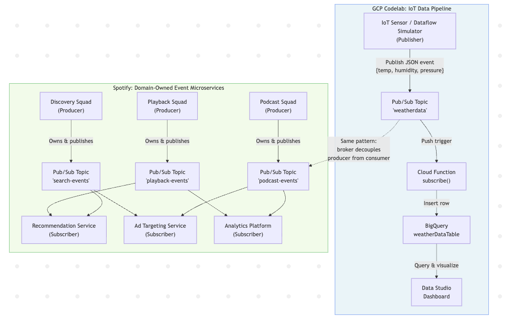
