# Lab 1 Report - Lian Welch

## Task 1
1. docker run hello-world
 - This command installs the docker hello world container from public Docker Hub because it cannot find it locally.
 - 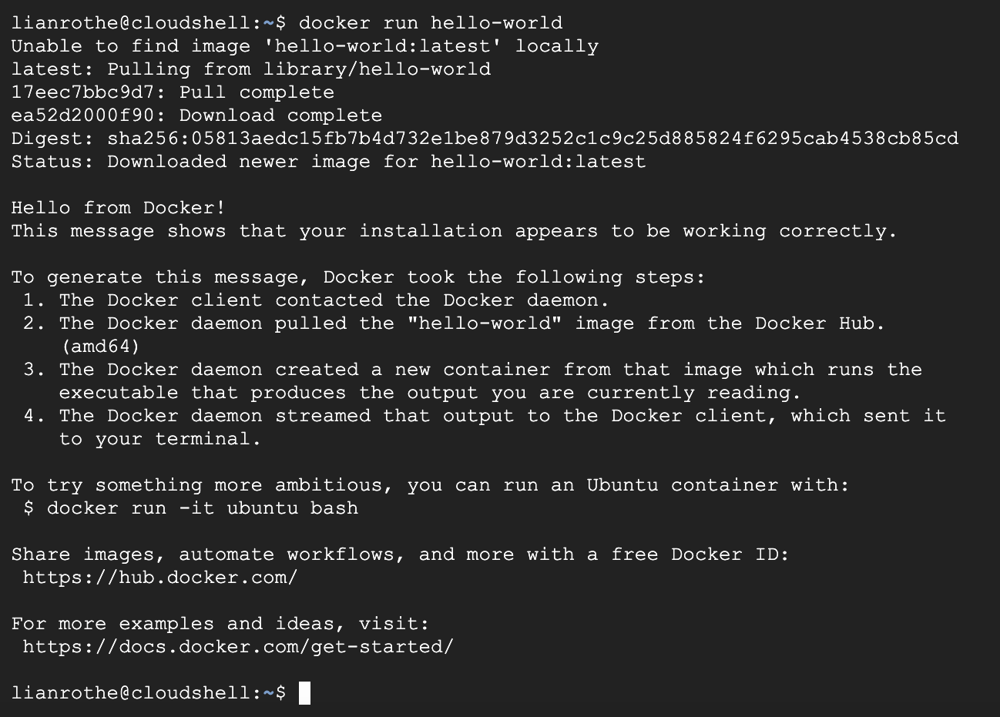

2. docker images
 - This command gives information about the container image pulled from Docker Hub
 - 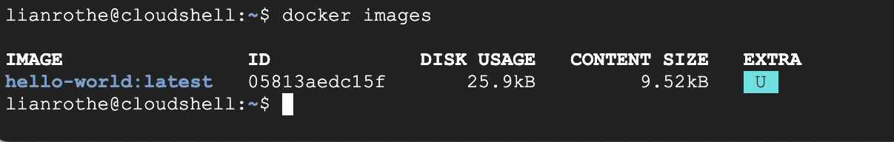

3. docker run hello-world
 - This runs the container again, this time the Docker is able to find the image locally and runs the container from that image.
 - 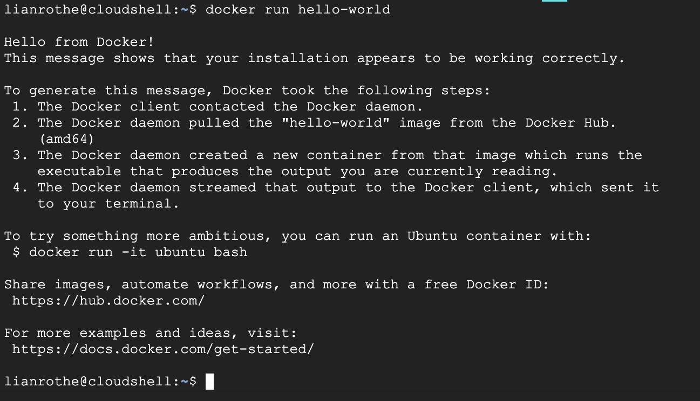

4. docker ps
 - This command shows the running containers, in this instance there are none because hello-world has been exited.
 - 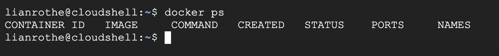

5. docker ps -a
 - This command shows the running, stopped, exited, and containers that have been created but not started.
 - 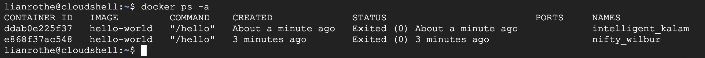
 
## Task 2
1. mkdir test && cd test
 - This creates and switches into a folder named test
 - See 2.2 screenshot

2. cat > Dockerfile << EOF FROM node:lts WORKDIR /app ADD . /app EXPOSE 80 CMD ["node", "app.js"] EOF
 - This sends the pasted file to a newly created file named Dockerfile with instructions on how to build the image.
 - 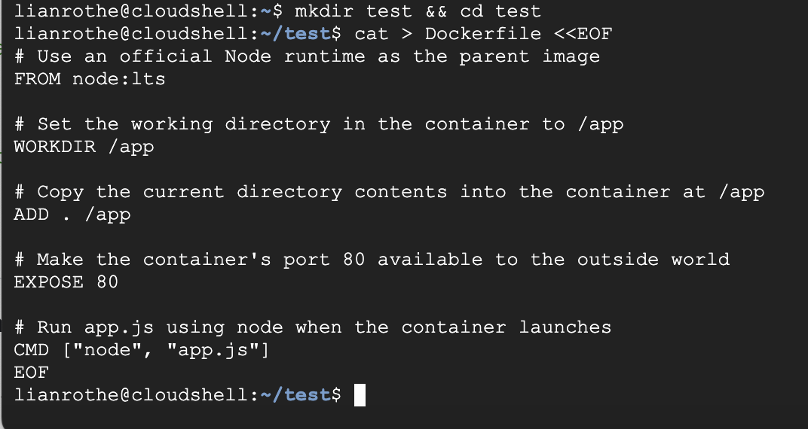

3. cat > app.js << EOF; const http = require("http"); const hostname = "0.0.0.0"; const port = 80; const server = http createServer((req, res) => { res.statusCode = 200; res.setHeaded("Content-Type", "text/plain"); res.end("Hello World\n");});server.listen(port, hostname, () => { console.log("Server running at http://%s:%s/", hostname, port); }); process.on("SIGINT", function () { console.log("Caught interrupt signal and will exit"); process.exit(); }); EOF
 - This is a HTTP server that is on port 80 and returns "Hello World", created and running. 
 - 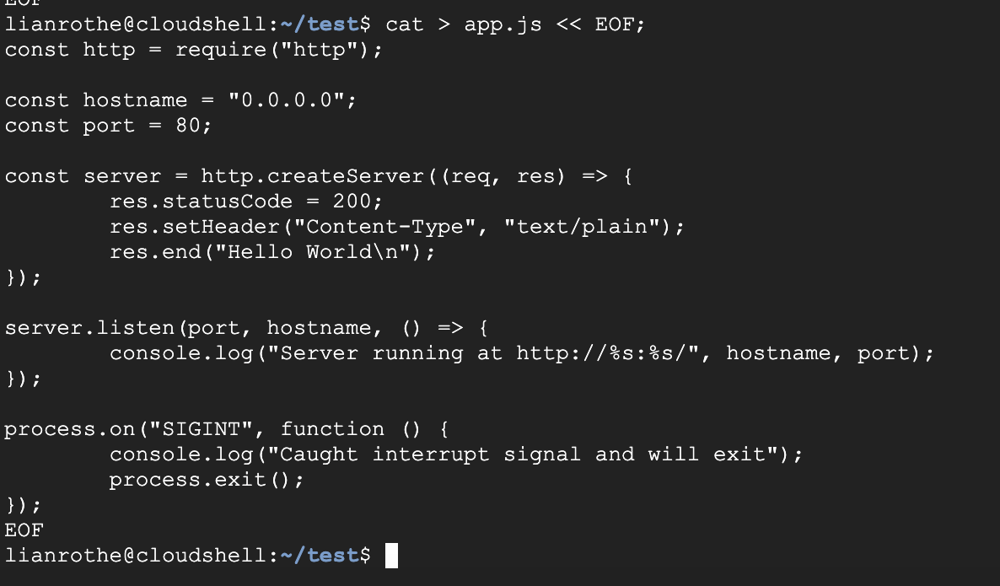

4. docker build -t node-app:0.1 .
 - This command builds the docker image, where the t names and tags the docker image while leaving a space and a . to indicate current directory. The name of the image is node-app and the tag is 0.1.
 - 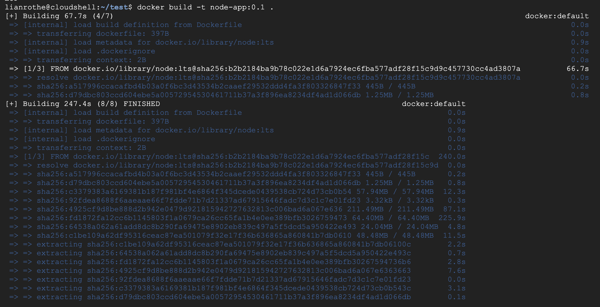

5. docker images
 - This looks at the images built, the difference this time is that node is the base image and node-app is the image just built. Node cannot be removed without node-app being removed first. The size is dependent on the project and needs of user.
 - 

## Task 3
1. docker run -p 4000:80 --name my-app node-app:0.1
 - This command runs the containers based on the image built. The server is now running on port 80 while the app is named and socked for the container specified.
 - 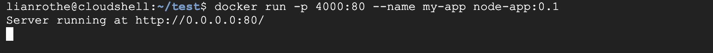

2. open another terminal and run; curl http://localhost:4000
 - This tests the server by accessing the localhost of the VM. The docker container is running on the google cloud VM.
 - 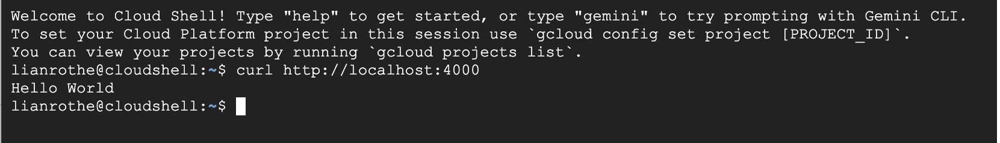

3. close initial terminal and run; docker stop my-app && docker rm my-app
 - This stops and removes
 - As seen as my-app my-app
 - See 3.4 screenshot

4. docker run -p 4000:80 --name my-app -d node-app:0.1 docker ps
 - This runs the container in the background with -d meaning detached mode.
 - This image shows 3.4 command, then 3.3 command, then 3.4 command again
 - 

5. docker logs 33
 - This command shows the logs running in the output of docker ps, displaying the container's output. 
 - 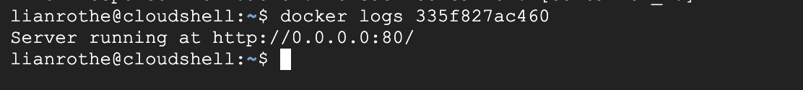

6. cd test
 - this makes test the current directory.
 - As can be seen by the ~/test in the 3.7 screenshot

7. nano app.js
 - This opened the app file as a text editor where I modified "Hello World".
 - At first I modified the file to "Welcome to Cloud", and later updated to "Hello CIS 4330" when exploring.
 - Control O, Enter, Control X to save and exit
 - 

8. docker build -t node-app:0.2 .
 - This command build the new image and tag with 0.2, updating the image's version number to be different than the original. The initial cache layer saved some of the layers making this build faster than the original, leaving only the edits to app.js to be built.
 - 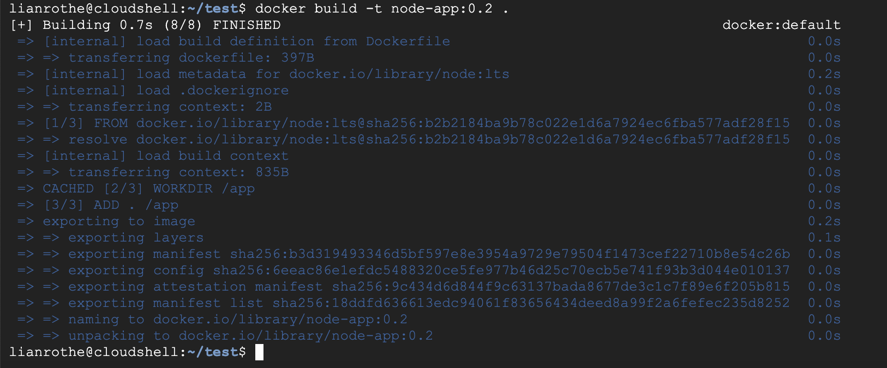

9. docker run -p 8080:80 --name my-app-2 -d node-app:0.2
docker ps
 - This runs another container with the new image version using a new port since 4000 is already in use. This runs a new iteration of containers and lists the currently running containers.
 - 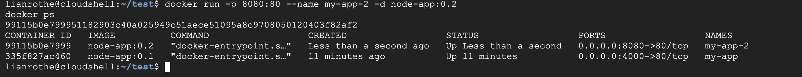

10. curl http://localhost:8080
 - This tests the second container, showing the updated docker container.
 - 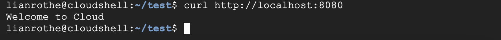

11. curl http://localhost:4000
 - This tests the first container, showing the original docker container. 
 - Revealing that both are running at the same time.
 - 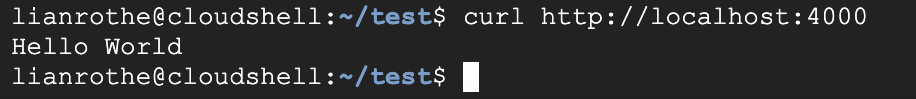

## Task 4
1. docker logs -f 99
 - This command displays the logs of a container, with the output as running.
 - Control C to exit
 - 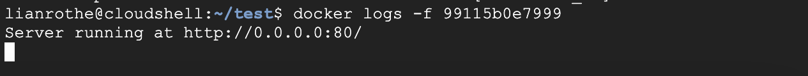

2. open another terminal and run; docker exec -it 99 bash
 - This opens an interactive bash session. This is the terminal of the container itself rather than the previous Google cloud VM. -i allows for interaction and -t ensures proper formatting.
 - 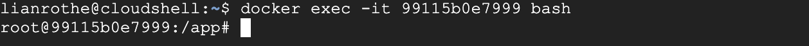

3. ls
 - This lists what is inside
 - 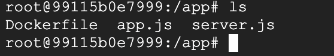

4. exit
 - Exits out of the Bash session
 - 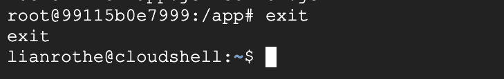

5. docker inspect 99
 - This displays the container's metadata in Docker.
 - 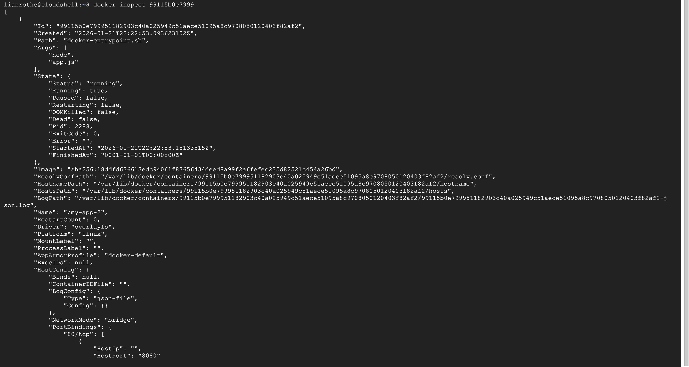

6. docker inspect --format='{{range .NetworkSettings.Networks}}{{.IPAddress}}{{end}}' 99
 - This command inspects specific fields form the JSON, in this case returning an IP address.
 - 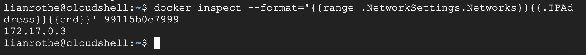

## Task 5
1. Create a new repository
 - This repo is set to us-east4 in project lianproject-9
 - 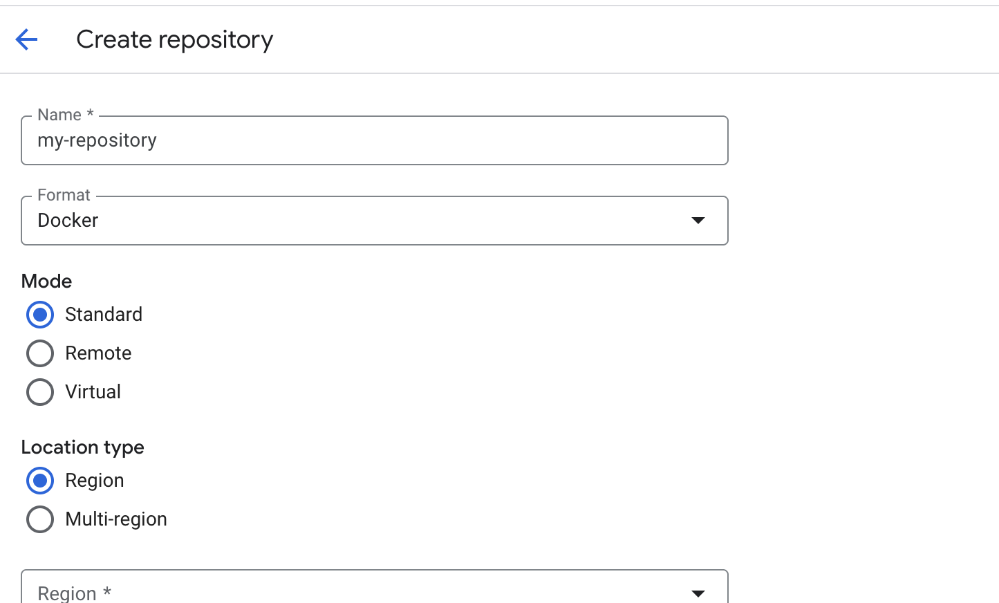

2. gcloud auth configure-docker us-east4-docker.pkg.dev
 - This command configures Docker to use the Google Cloud CLI as a way to authenticate requests to Artifact Registry.
 - 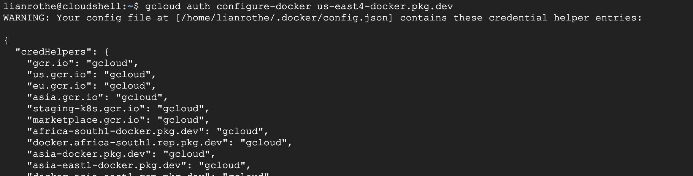

3. gcloud artifacts repositories create my-repository --repository-format=docker --location=us-east4 --description="Docker repository"
 - This step was skipped because the repo was made through the Google Cloud interface.

4. cd ~/test
 - Change the current directory to test
 - Can be seen in screenshot 5.5

5. docker build -t us-east4-docker.pkg.dev/lianproject-9/my-repository/node-app:0.2 .
 - This builds the docker images.
 - A minor issue that was easily fixed
 - The screenshot shows cloudshell, but was later replaced with lianproject-9 and rebuilt
 - 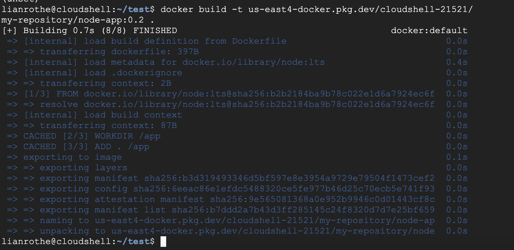

6. docker images
 - A way to check the built Docker images.
 - Continuation of the minor issue that was fixed with correcting the previous command
 - Again this screenshot shows cloudshell, which was later fixed to lianproject-9 as well as cleared out for only the needed image built
 - 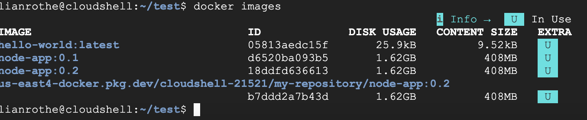

#### Issue
7. docker push us-east4-docker.pkg.dev/lianproject-9/my-repository/node-app:0.2
 - An alternate command was required and is explained in the Issues section of the report where screenshots can be found

8. Navigate to my-repository on the Google Cloud interface to find the node-app docker container successfully created.
 - 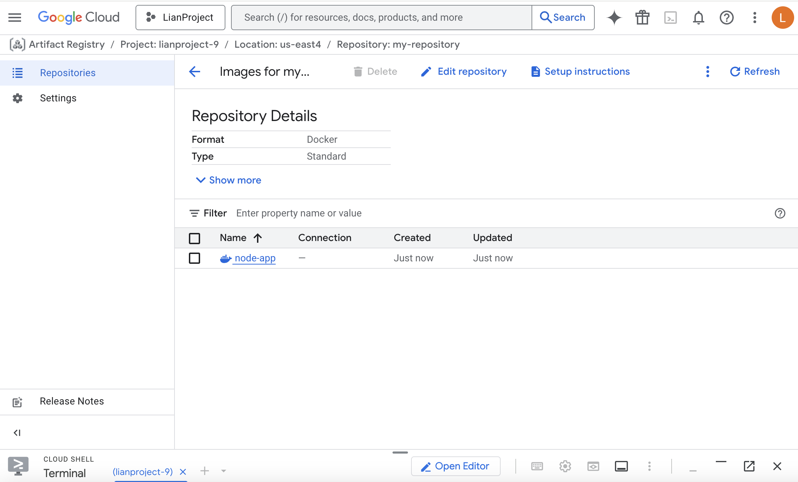

## Testing Image
1. docker push ues-east4-docker.pkg.dev/lianproject-9/my-repository/node-app:0.2
 - This command looks for docker images to stop and remove.
 - All docker images had already been stopped
 - 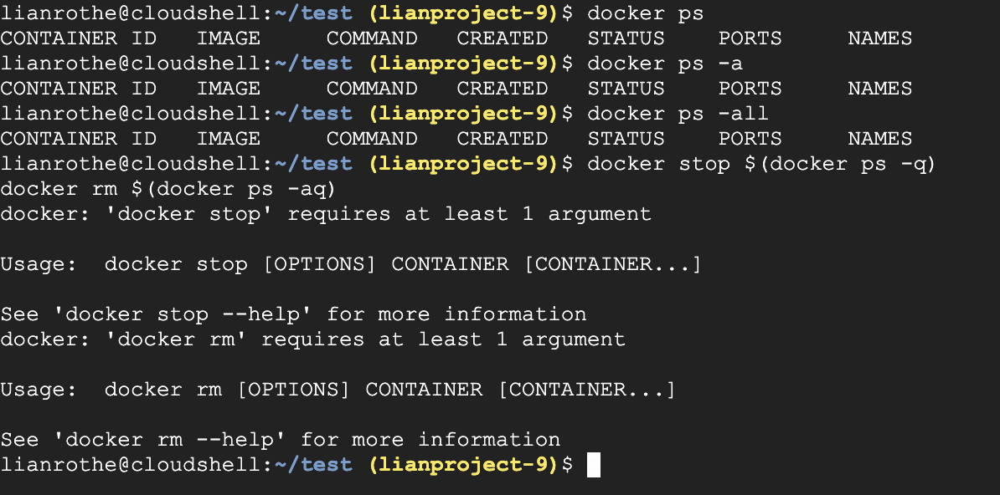

2. docker rmi us-east9-docker.pkg.dev/lianproject-9/my-repository/node-app:0.2
docker rmi node:lts
docker rmi -f $(docker images -aq) # remove remaining images
docker images
 - This command removes any remaining and displays an empty table, showing that there are no remaining images in the VM.
 - 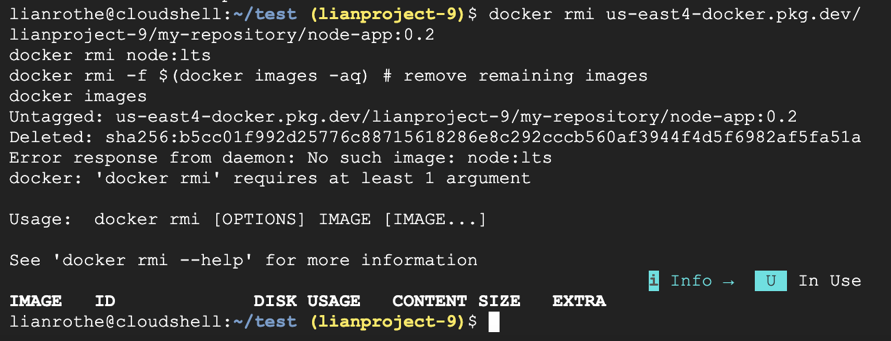

3. docker run -p 4000:80 -d us-east4-docker.pkg.dev/lianproject-9/my-repository/node-app:0.2
 - This pulls and runs the image.
 - See testing.4 screenshot below.

4. curl http://localhost:4000
 - This runs a curl against the running container and shows that the image was successfully packaged and stored on the us-east4 server.
 - 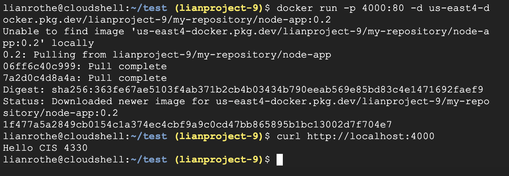

## Diagram
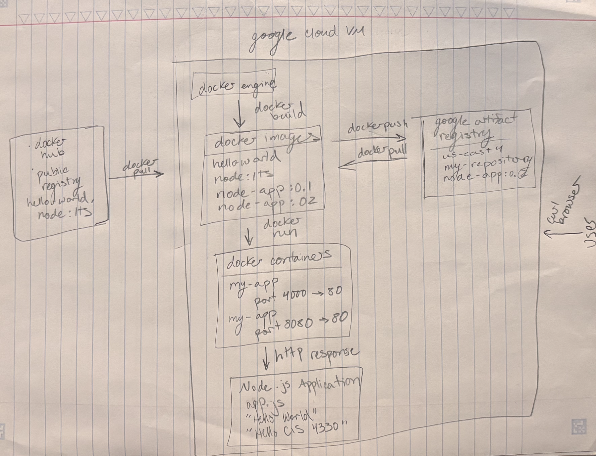
The diagram above shows the Docker workflow used in Lab 1. This illustration shows pulling public images from Docker hub into the Docker engine running on the Google Cloud VM. An application image (Node.js) is built locally from a Dockerfile, allowing for other versioned images to be made. Those other images, node-app:0.1 and node-app:0.2, are then used to run containers. These containers map a host port (4000 and 8080) to the container's port 80. All of this allows for HTTP request through curl or a browser to reach the application. The Google Artifact Registry is included to show the custom image pushed and stored remotely and pulled for later use.

## Containers
Containers can have an effect on microservices, whether that affect may aid or inhibit. A container is a packaging and runtime technology, in this context a Docker. This works in a way to combine applications with its dependencies, so it works the same across all environments. A microservice is an architectural style that entails small, independent deployable services. Containerizing an application does not always imply microservices, putting an application in a container doesn't change its architecture. These are the differences between design decisions, not tooling outcomes. Containers can aid microservices by making the core principles easier to execute. Each microservice can have its own container image, there can be different tech stacks per service, and CD pipelines can be simpler and more consistent. Using containers allows for scaling individual services independently as well as independent updates without needing downtime. With containers microservices can have each service run on its own isolated environment while reducing dependency conflicts. Although, containers can hide bad architecture, making them an operational tool not a sound architectural approach.

## Issues
I experienced a Cloud Shell and Artifact Registry credential issue that presented itself as a connection issue.

 - "No valid credential was supplied"
 - Waiting instead of Pushed
 - Connection refused

 Example:

 lianrothe@cloudshell:~/test (lianproject-9)$ docker push us-east4-docker.pkg.dev/lianproject-9/my-repository/node-app:0.2 
 The push refers to repository [us-east4-docker.pkg.dev/lianproject-9/my-repository/node-app] 853dfe95769f: Waiting 063e0b1dd7bd: Waiting c1be109a62df: Waiting 64538a062a61: Waiting fd1872fa12cc: Waiting 4925cf9d8be8: Waiting c3379383a616: Waiting a517996ccaca: Waiting 92fdea8688f6: Waiting d79dbc803ccd: Waiting af6154ef075c: Waiting failed to do request: Head "https://us-east4-docker.pkg.dev/v2/lianproject-9/my-repository/node-app/blobs/sha256:c3379383a6169381b187f981bf4e6864f345dcede0439538cb724d73cb0b543c": dial tcp 173.194.217.82:443: connect: connection refused lianrothe@cloudshell:~/test (lianproject-9)$

 These errors appeared after I had already confirmed that the repo, project, and image were tagged correctly. I had also gone through every procedure I could to ensure my account and project was connected and authorized.

 The best solution I could find was to bypass the Docker's network path completely and push it using a more supported GCP method.

 - gcloud builds submit \
  --tag us-east4-docker.pkg.dev/lianproject-9/my-repository/node-app:0.2 

 The command above uploads the image without the Docker needing direct registry access. It does so by uploading source to Cloud Build, builds inside Google's network, pushes directly to the Artifact Registry, and avoids Cloud Shell Docker authentication and TCP issues.

 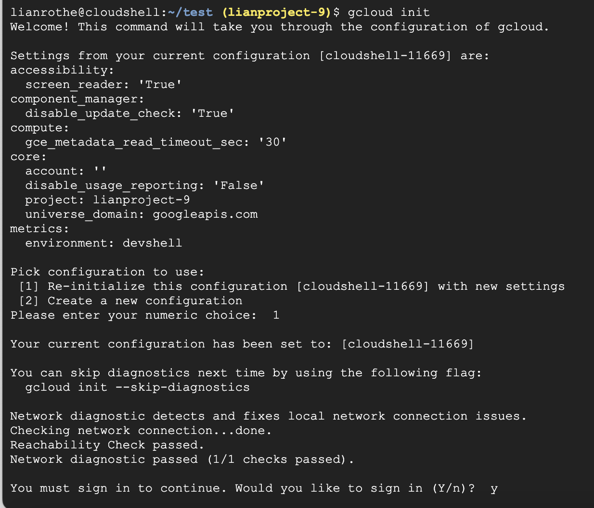
 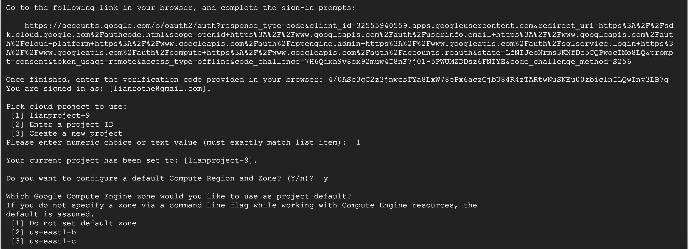
 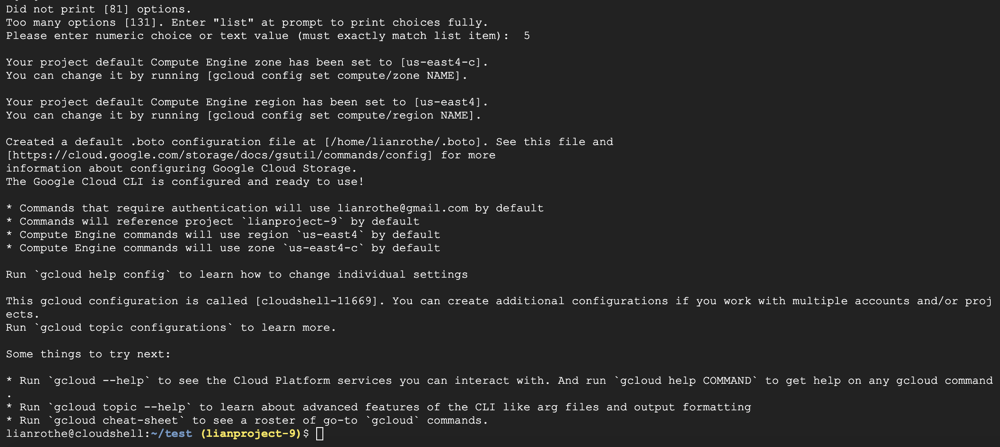
 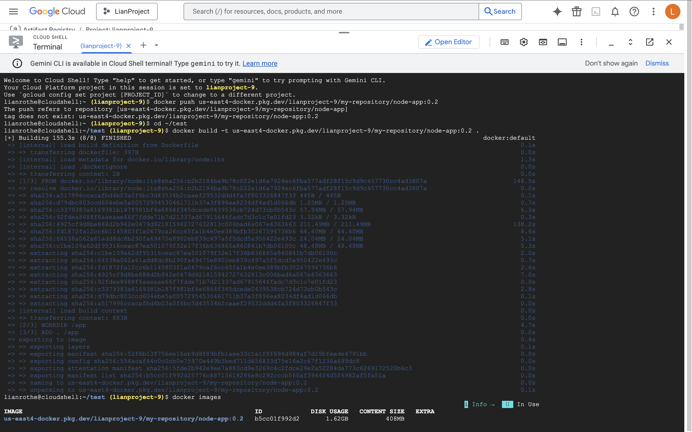
 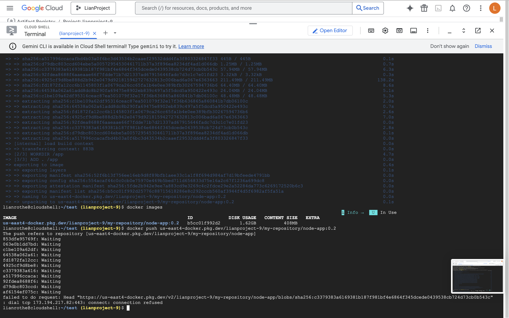
 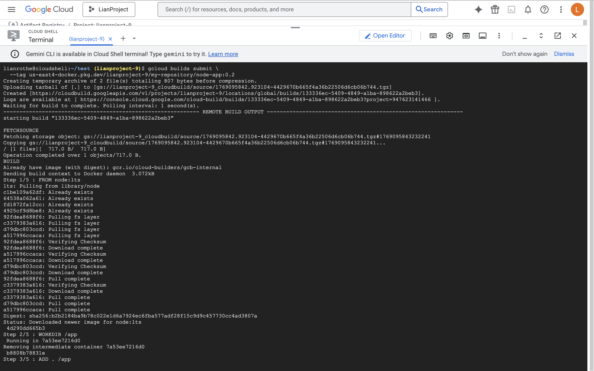
 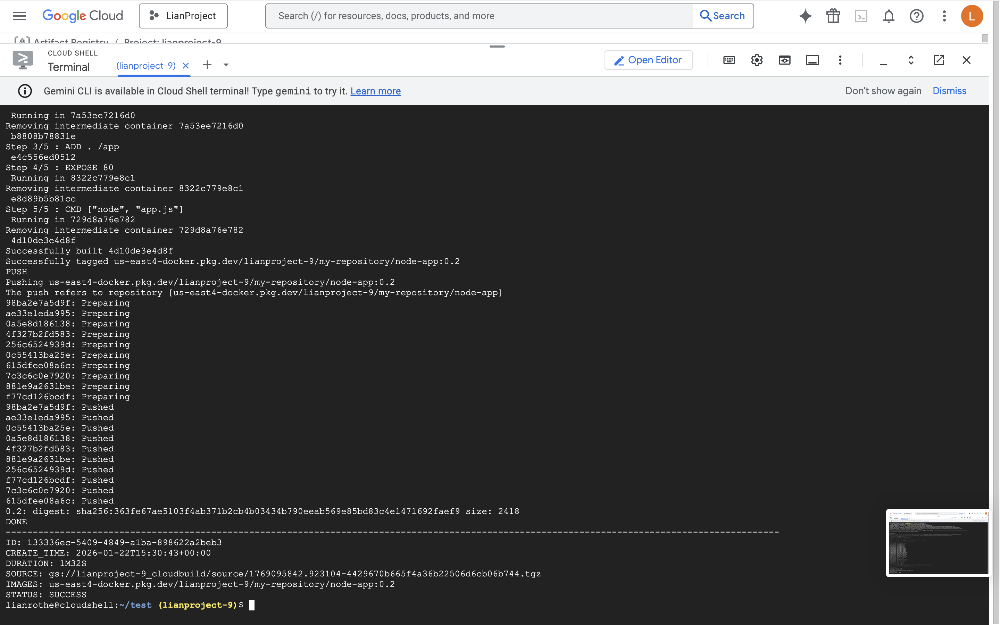

## Credit Check
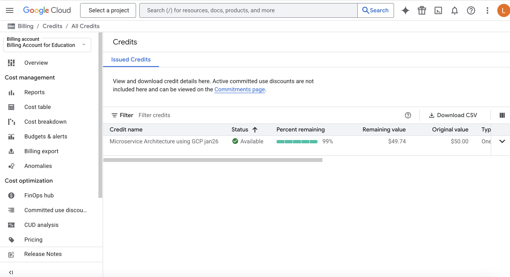

## Video
I have watched the Cloud Computing Video by Google.
- 
-
- 
