# Lab 2 Report - Lian Welch -- to do - spell/ grammar check

## Task 1
- The Google Cloud Platform GUI was used to enable the Kubernetes Engine for my GCP account.
## Task 2
1. gcloud config get-value project
- This command shows the project ID to ensure that the lab will be executed in the proper location
- 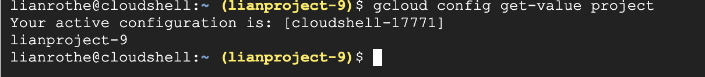

2. gcloud config get-value compute/zone
- This command checks to see the current zone, where in my case one was not yet configured, see screenshot 2.3 below to see the set then get for the proper display.

3. gcloud config set compute/zone us-east1-b
- This command sets the compute zone to us-east1-b, which will be used for the rest of the lab assignment to determine where the virtual machines will be created
- 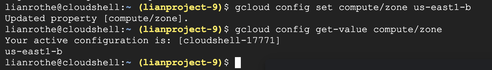

4. gcloud container clusters create gke-cluster \
  --num-nodes=3 \
  --machine-type=e2-medium \
  --disk-type=pd-balanced \
  --disk-size=30
- This command creates the Kubernetes cluster, names it gke-cluster, allocates three nodes, deploys the cluster to the preset compute zone, and enables Google-managed Kubernetes control plane services.
- 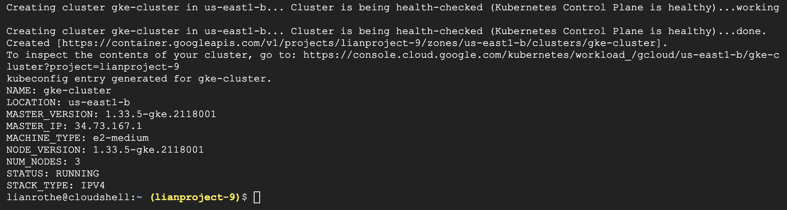

5. gcloud container clusters list
- This command displays all of the Kubernetes clusters associated with my GCP project, which shows the name, location, number of worker nodes, and the status. This was run to confirm that the GKE cluster is available.
- 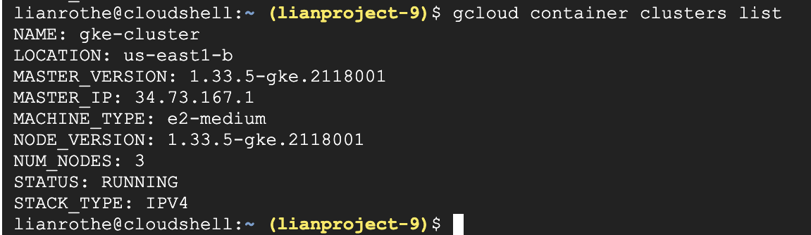

6. gcloud container clusters get-credentials gke-cluster \
  --zone us-east1-b
- This command displays authentication and connection information by giving the cluster endpoints, downloading the authentication credentials, updates the local file, and allows for secure communication between kebectl and the cluster
- 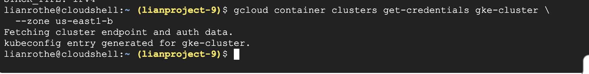

7. kubectl get nodes
- This command displays information about the allocated worker nodes. This identity is where the pods will be dynamically scheduled by Kubernetes.
- 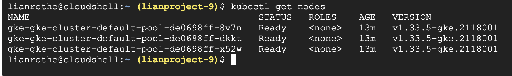

## Task 3
0. gcloud auth login
- This process allows for access to the GKE cluster.
- 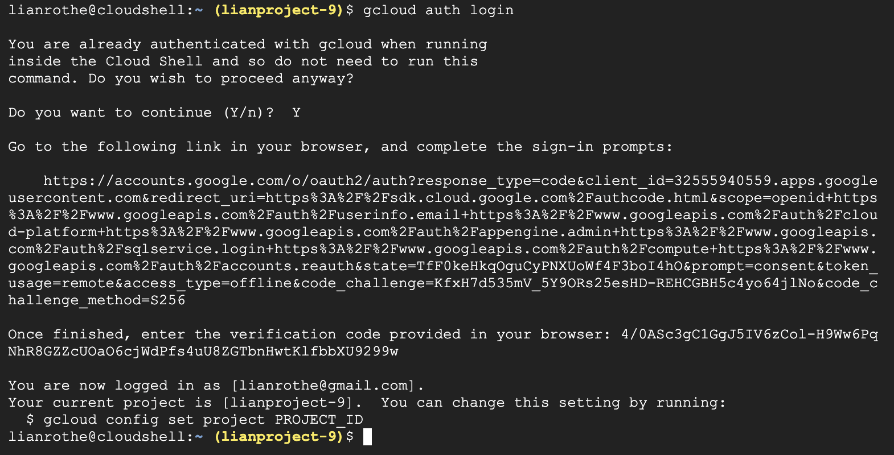

1. kubectl run nginx --image=nginx
- This command creates a pod named nginx and displays the confirmation.
- 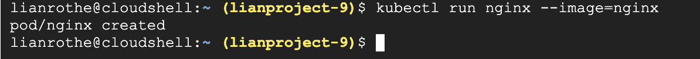

2. kubectl run server --image=nginx
- This command creates a server pod named server, that acts as a backend web server. Nginx works as a stand in application for a microservice in terms of looking at the serves and how the deploy and communicate inside Kubernetes. This works because it is lightweight, easy to deploy, containerized, listens to HTTP ports, and allows Kubernetes deployment.
- 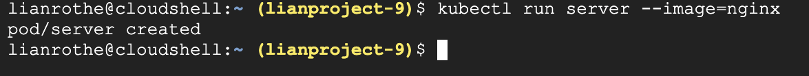

3. kubectl run client --image=nginx
- This command assigns a pod to work as a client that sends HTTP requests to the server pod, the only use of the function is to use networking commands from inside the cluster allowing for pod to pod communication.
- 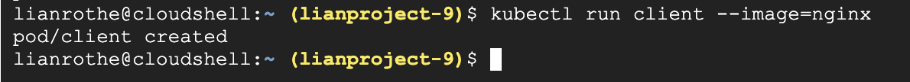

4. kubectl get pods
- This command displays the pods and their information.
- 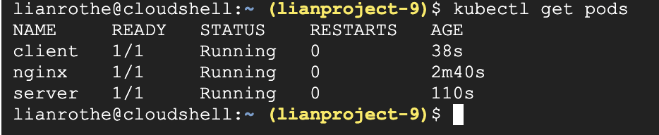

5. kubectl get nodes
- This command displays the worker nodes in the Kubernetes as well as their information.
- 

6. kubectl exec server -- curl localhost
- This command verifies that nginx is running inside the server pod by executing curl local host inside the server pod. The screenshot below shows that the container is running and that nginx is responding locally by the display of the default nginx HTML.
- 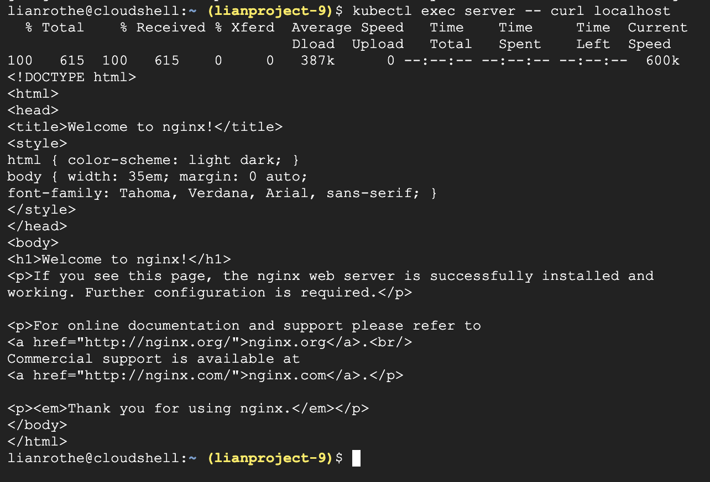

7. kubectl describe pod server | grep IP
- This command displays information about the server pod, in this case the IP address.
- 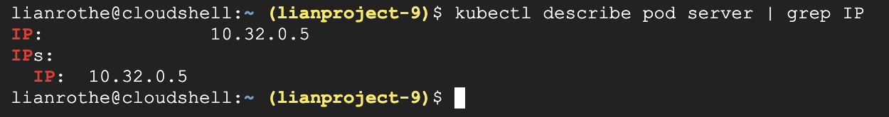

8. kubectl exec client -- curl 10.32.0.5
- This command sends a request to the server pod from the client pod using the IP address that was identified in the previous command.
- 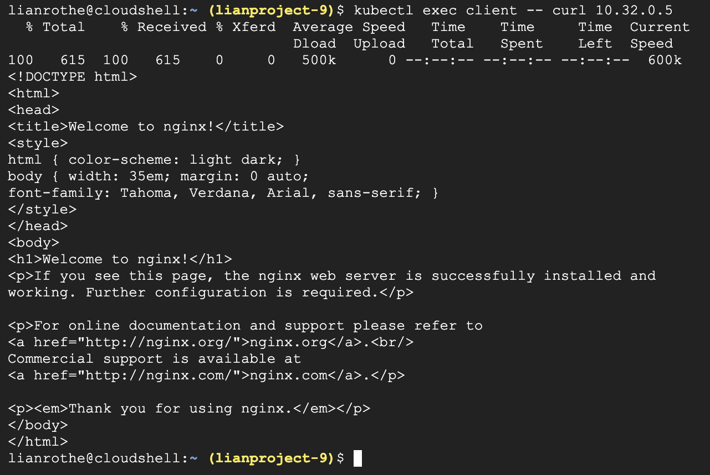

## Task 4
1. kubectl expose pod server \
  --name=server-service \
  --port=80 \
  --target-port=80
- This command creates the default type of Service in Kubernetes, which is ClusterIp.
- 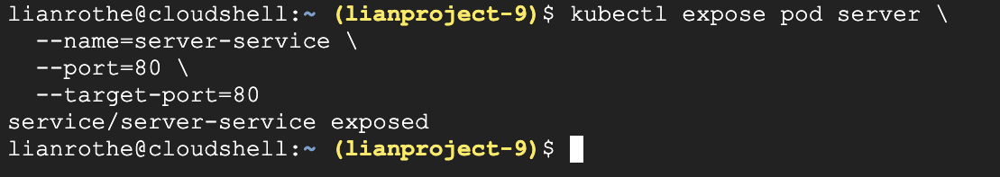

2. kubectl get services
- This command displays the list of Services.
- 

3. kubectl describe service server-service
- This command displays information about the Service, such as stable ClusterIP, server pod, and automatically tracking pod's health.
- 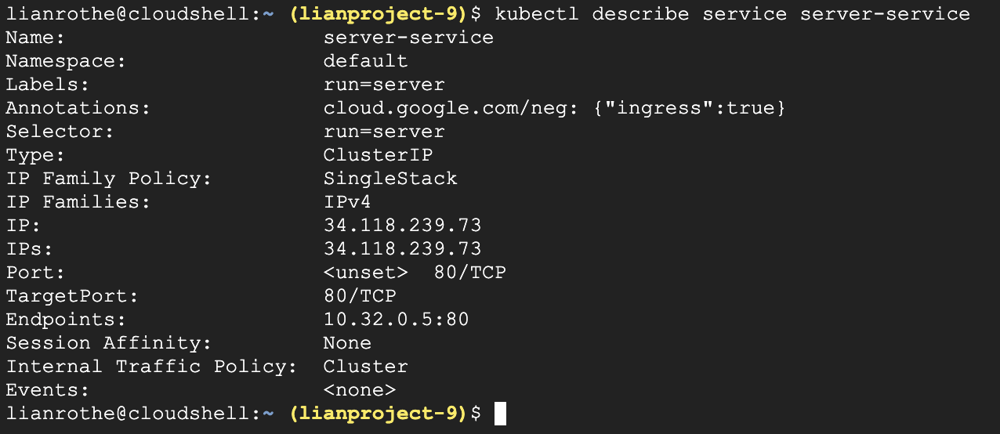

## Task 5
1. kubectl run dns-client \
  --image=busybox:1.36 \
  --restart=Never \
  -- sleep 3600
- This command creates a temporary debug pod from a container image called busy-box.
- 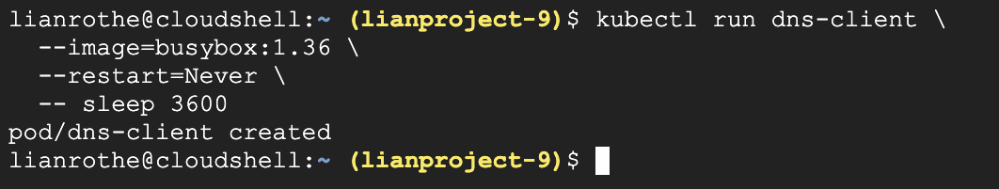

2. kubectl exec dns-client -- nslookup server-service
- This command displays the Server DNS name and ClusterIP address (assigned to the Service) for the service created earlier called server-service.
- 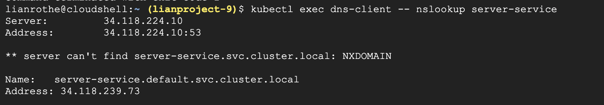

## Task 6
1. kubectl exec client -- curl server-service
- This command sends an HTTP request using the Service name from the client pod, confirming that the DNS resolved the Service name, traffic was sent to the Service ClusterIP, and Kubernetes forwarded the request to the server pod. 
- 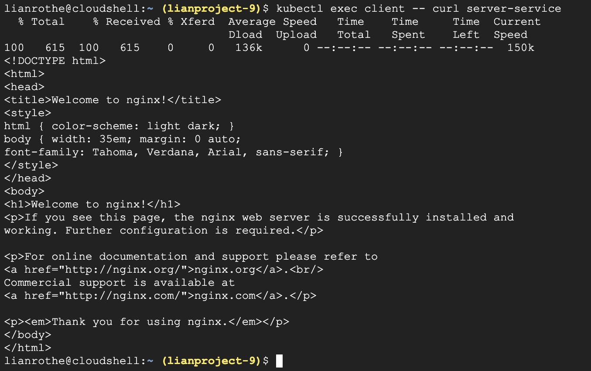

2. kubectl exec client -- curl server-service
- This command repeats the request to demonstrate that the client communicates using the Service name rather than the pod IP, a stable network is supplied by the Service, and request path remains the same. 
- 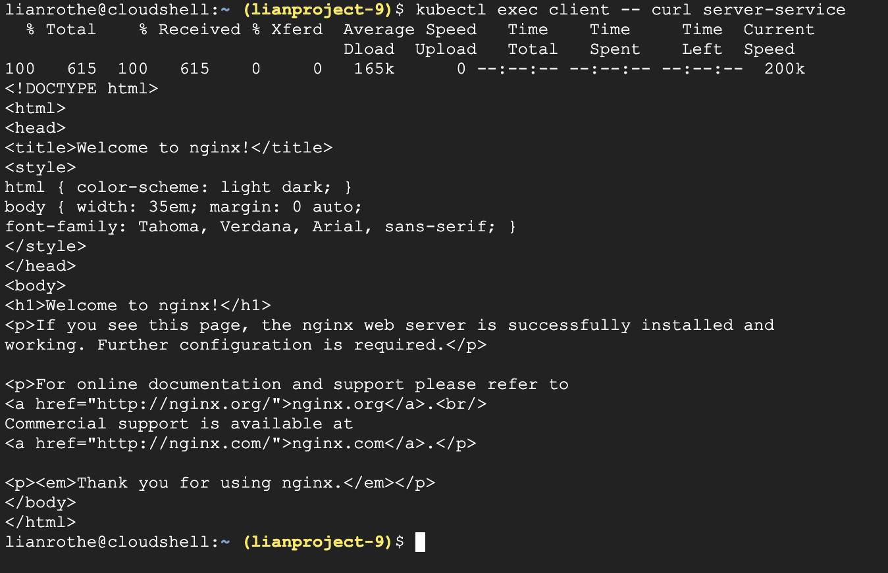

## Reflection
1. Before Kubernetes, an application composed of multiple containers may be managed using only a Docker. This is done manually by docker run, the networking would rely on hardcoded container IPs or Docker bridge networks and container names. The container lifecycle would be managed by scripts manually and scaling would require manually starting containers. Many challenges would arise as the number of containers increased. There is no scheduling across machines, no automatic restart or self healing if containers fail, no native service discovery, and operational complexity increases.

2. A Pod is an instance that groups one or more containers. Containers that are within the same Pod share an IP address, network namespace, are scheduled together, and on the same node. Kubernetes treat a Pod like the smallest deployable unit because this simplifies the networking and management when it schedules, restarts, and scales Pods. Kubernetes does not manage containers directly because they do not have a stable network identity meaning that Pods offer a dynamic option when considering scalability where each nginx container ran inside its own Pod.

3. Services are necessary in Kubernetes because Pods are ephemeral, meaning that Pods can be deleted, restarted, and their IP addresses change. Services solve the problem of changing pod IP addresses by providing a stable virtual IP (ClusterIP) and a stable DNS name, and automatically direct to a healthy backend, all without the client needing to know the Pod's IP address. This capability capability is essential for microservice architectures because they scale independently, instances are created and destroyed dynamically.

4. When a Service is created the Kubernetes registers it with CoreDNS and a DNS record is automatically created. Which can be seen when nslookup server-service returned the Server name and ClusterIP and when curl server-service reached the backend. Service discovery is considered a core requirement for MSA because Services find each other dynamically allowing for scaling which means potential for rolling updates. 

5. It is more effective to run applications as multiple containerized services managed by Kubernetes. Using Kubernetes allows for independent scaling of services, automatic restart, and loose coupling via Services and DNS.

## Diagram
- 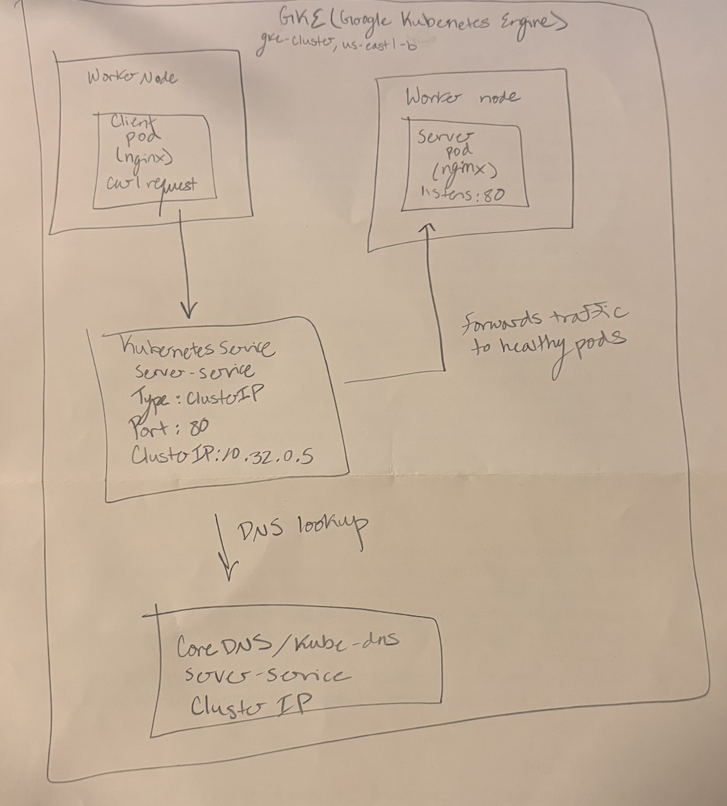
- The diagram above depicts the workflow of lab 2, both with internal networking and service discovery. As seen above, a client pod initiates a HTTP request by using server-service as the Service name, not the pod IP address. The Service name is resolved to a stable ClusterIP by Kubernetes DNS. After that, the request is sent to the ClusterIP where Kubernetes Service forwards the traffic to a backend server pod using nginx. The server pod then processes the request and returns the response to the client pod via the Service. All of this to demonstrate how Kubernetes allows for clients to form individual pod IPs, reliable service discovery, stable networking, and pod to pod communication within the cluster. 

## Clean up confirmation
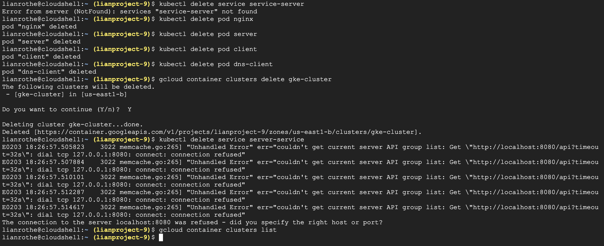

