# Lab 4 Report - Lian Welch

## Task 1
---
- gcloud auth list
- gcloud config list project
- gcloud config set project lianproject-9
- gcloud config set compute/zone us-east1-b
- gcloud config list compute/zone
- gcloud config get-value compute/zone
- 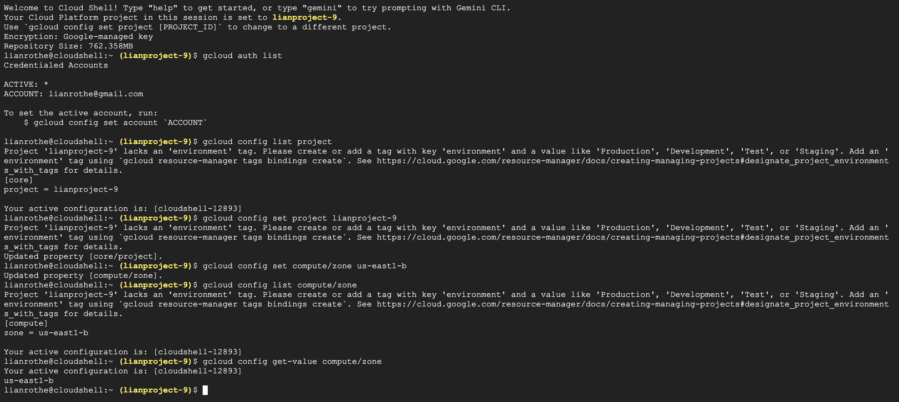
- This step is preparing the google cloud environment by confirming that the Cloud Shell is properly configured with the correct compute and zone.
---
- gcloud services enable \
  cloudresourcemanager.googleapis.com \
  container.googleapis.com \
  artifactregistry.googleapis.com
- gcloud projects add-iam-policy-binding lianproject-9 --member="user:lianrothe@gmail.com" --role="roles/cloudbuild.builds.editor"
- 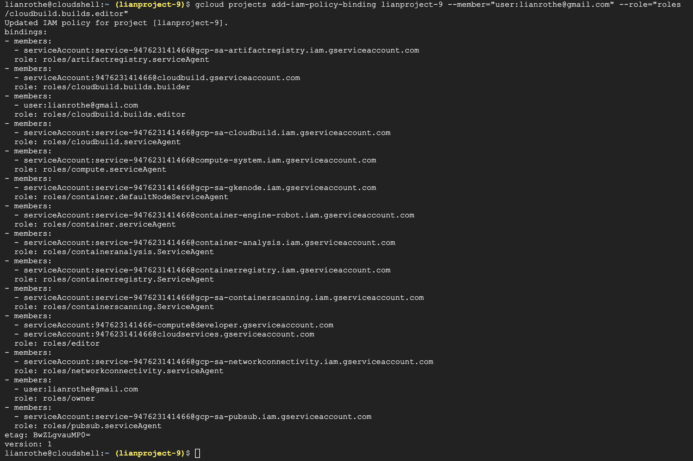
- These commands enables the Google Kubernetes Engine API required to create clusters by enabling the API for pulling images.
---
- gcloud container clusters list
- gcloud container clusters create gke-cluster \
  --num-nodes=3 \
  --machine-type=e2-medium \
  --disk-type=pd-balanced \
  --disk-size=30 \
  --zone us-east1-b
- gcloud container clusters list
- 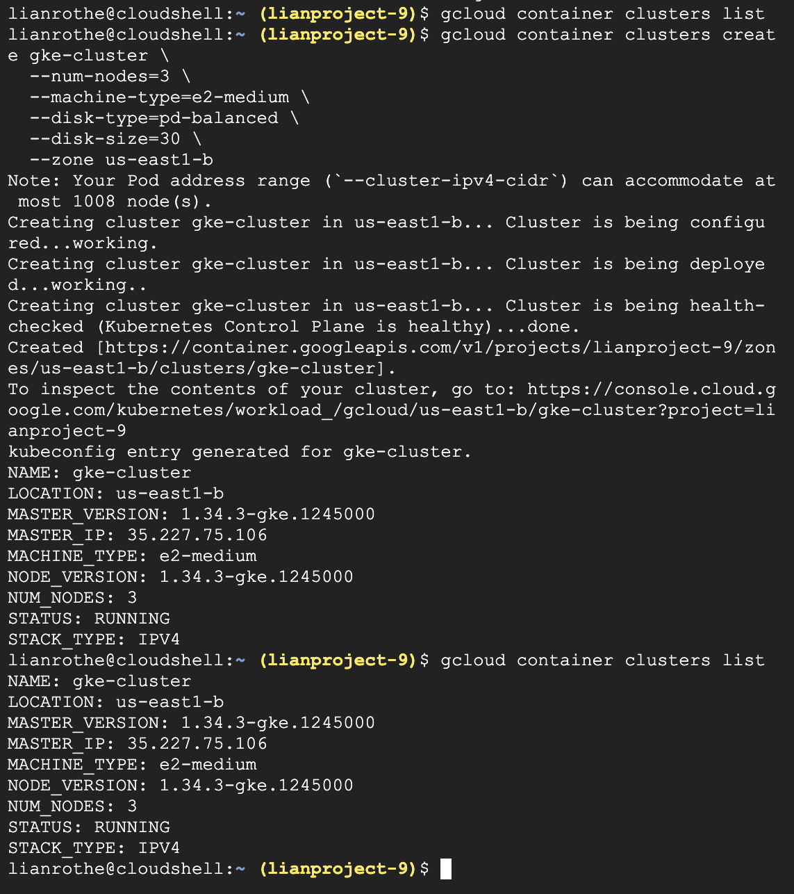
- These commands check for exisiting clusters and verifies with displaying the existing clusters. This is important because GKE must provision virtual machines, networking, and control-plane components.
---
- gcloud container clusters get-credentials gke-cluster \
  --zone us-east1-b
- 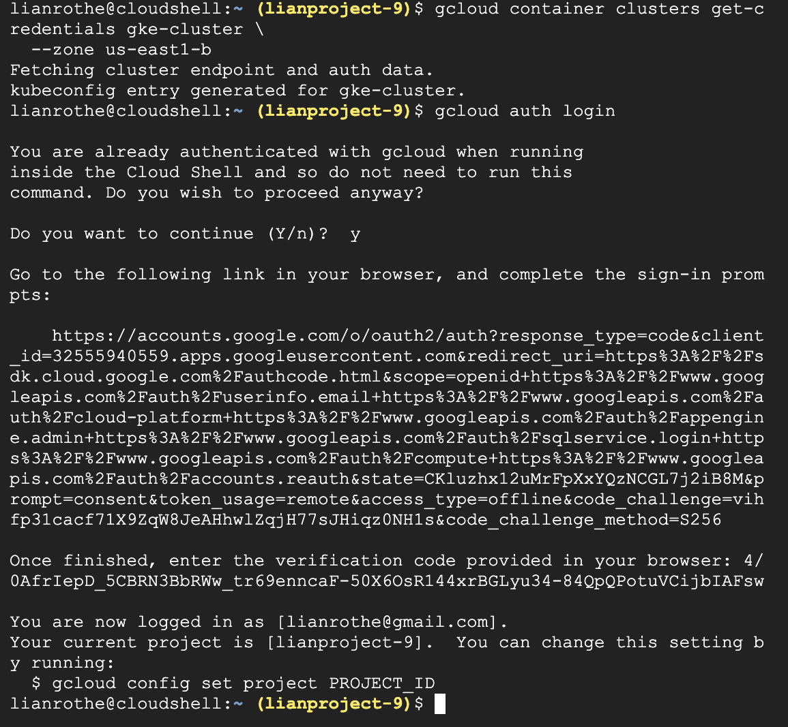
- This command retireves the credentials so that kubectl can talk to the new cluster because Cloud Shell uses kubectl to communicate with Kubernetes. It specifically retrieves the cluster endpoint, downloads authentication credentials, updates the local kubeconfig file, and enables secure communication between kubectl and the cluster. 
---
- kubectl get nodes
- echo $ART_REG
- 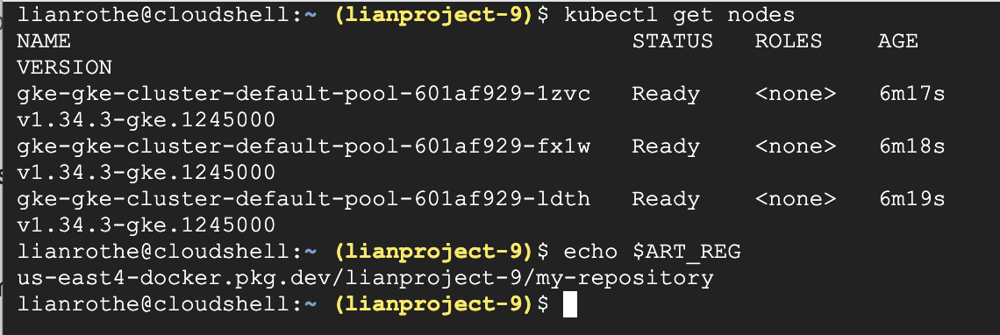
- These commands displays the worker nodes in a ready state and verifies the previous set environmental variable for the Artifact Registry location. This is done to show that the GKE cluster is successfully created and configured.
---
## Task 2
---
- cd ~
- cd gke-microservices-manifests
- pwd
- ls
- kubectl apply -f products-deployment.yaml
- kubectl apply -f products-service.yaml
- kubectl apply -f orders.yaml
- kubectl run http-client --image=curlimages/curl:8.5.0 --restart=Never -- sleep infinity
- kubectl get pod http-client
- kubectl get deploy
- kubectl get pods
- kubectl get svc
- kubectl exec -it http-client -- curl -s http://products-service/api/products | head
- kubectl exec -it http-client -- curl -s http://orders-service/api/orders | head
- 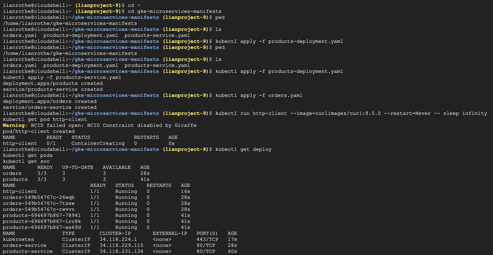
- 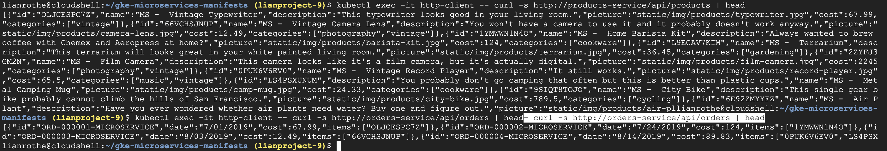
- These commands first naviagtes to the manifest directory, then delpoyes the products and orders microservices, and creates the in-cluster HTTP test pod. The navigtion is done to confirm that the correct yaml files exist. The successful respnses from the deploy, baseline, and validate commands shows that the microservices (from Lab 3) are running again exactly as before. 
---
## Task 3
---
- cd ~/monolith-to-microservices/microservices/src/orders
- pwd
- ls
- printf '\napp.get("/version", (req,res)=>res.json({version:"v2"}));\n' >> server.js
- cat server.js
- gcloud builds submit --tag "$ART_REG/orders:v2" .
- gcloud artifacts docker images list $ART_REG --include-tags
- 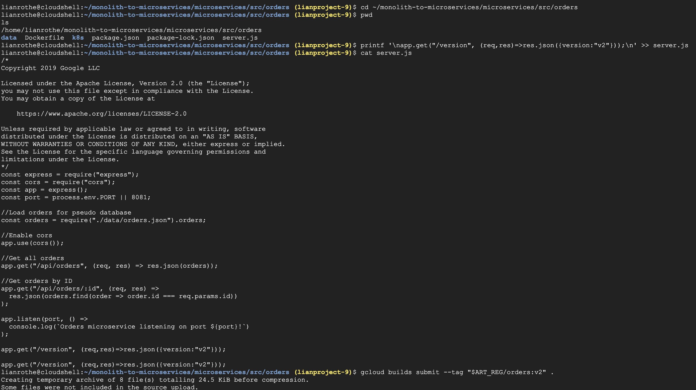
- 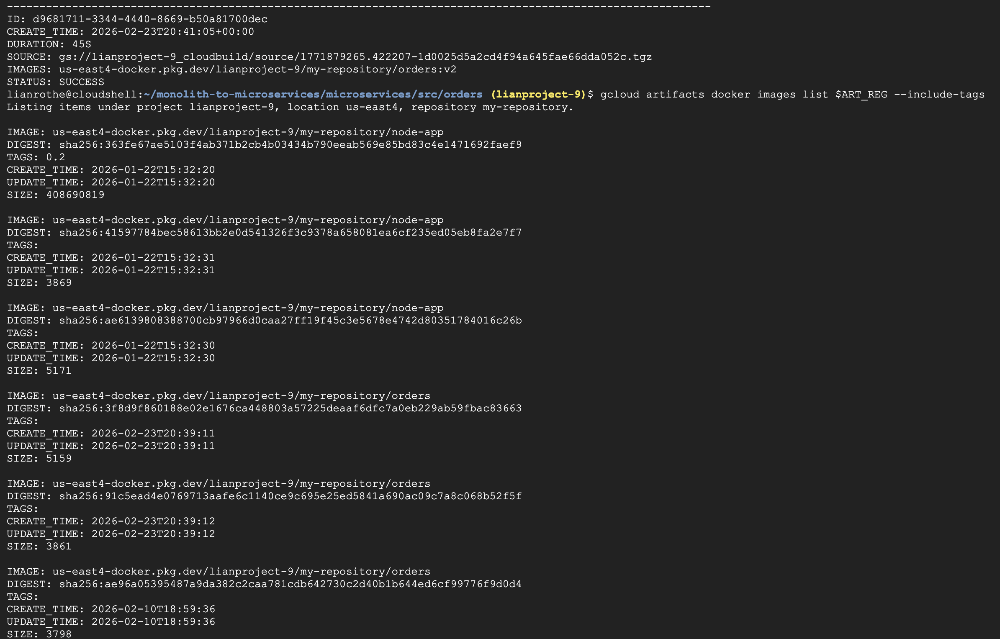
- 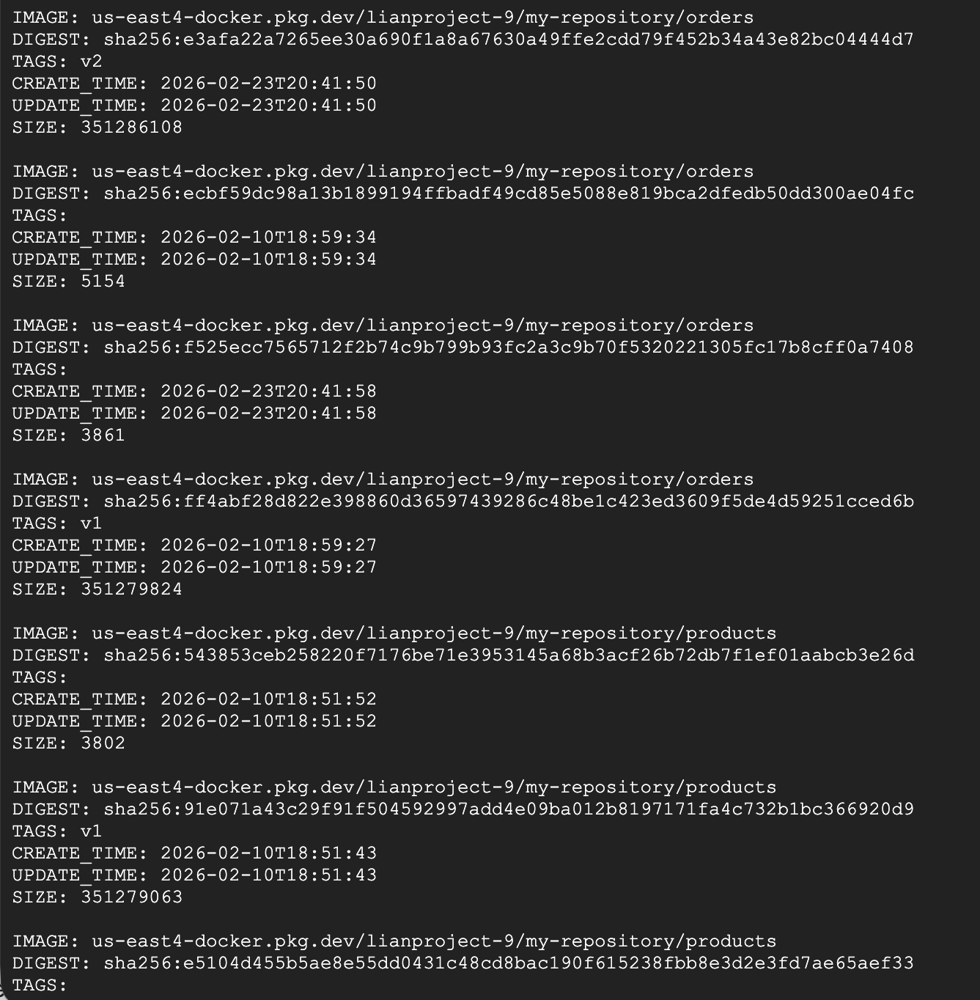
- These commands first navigate to the proper location, then builds the v2 contianer image, and then verfies that the image exists in Artifact Registry. A new release of the service is shown by adding a small endpoint because the original orders service did not have explicit information, doing this allows for a visibe difference between the versions without changing the core logic, making the Kubernetes rollout strategies affect real traffic. 
---
## Task 4
---
- kubectl get deploy orders -o=jsonpath='{.spec.template.spec.containers[0].image}{"\n"}'
- kubectl set image deployment/orders orders=${ART_REG}/orders:v2
- kubectl rollout pause deployment/orders
- kubectl rollout status deployment/orders
- kubectl rollout status deployment/orders
- kubectl get rs -l app=orders
- kubectl get pods -l app=orders
- kubectl exec -it http-client -- sh -c 'for i in $(seq 1 10); do echo -n "$i: "; curl -s -w " (%{http_code})\n" http://orders-service/version; done'
- kubectl rollout resume deployment/orders
- kubectl rollout status deployment/orders
- kubectl rollout undo deployment/orders
- kubectl rollout status deployment/orders
- kubectl get deploy orders -o=jsonpath='{.spec.template.spec.containers[0].image}{"\n"}'
- kubectl get pods -l app=orders -o custom-columns=NAME:.metadata.name,IMAGE:.spec.containers[0].image
- 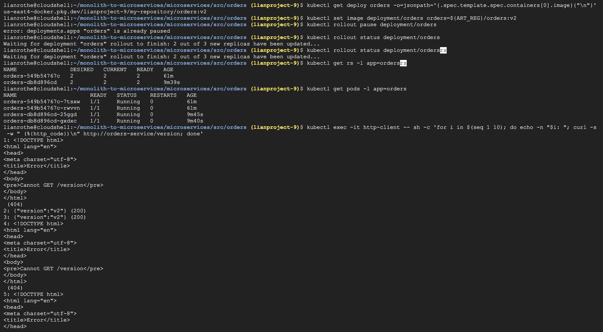
- 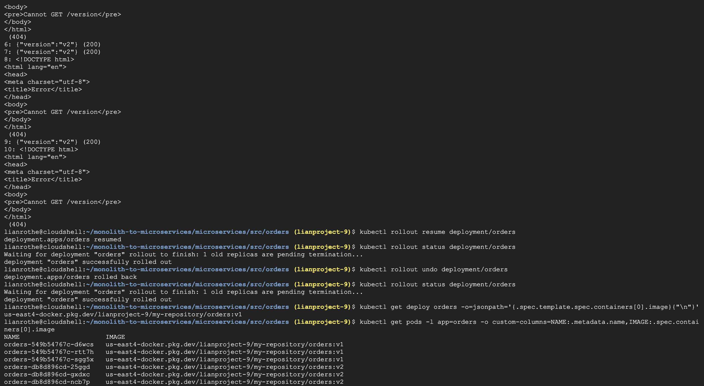
- 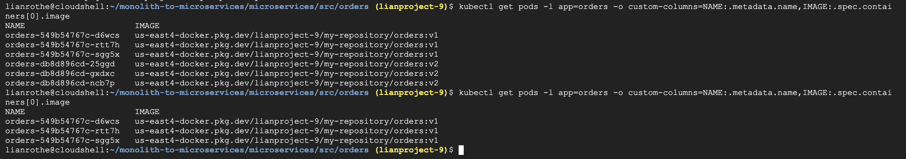
- These commands where done to understand how Kubernetes creates new Pods with the updated image, waits for them to become ready, gradually replaces the old Pods, and then keeps the Service available the entire time all to enable zero-downtime upgrades. The process starts by confirming the Deployment is still running v1 and trigger the rolling update by upgrading the orders Deployment to the new image. This is done because it updates te Deployment specification that triggers Kubernetes to begin a rolling update automatically. Throughout the next commands it is possible to observe a new ReplicaSet created, new Pods appearing gradually, and old Pods terminating only after new Pods are ready. The 200 return value form the majority of the responses shows that the rolling update has been completed and the Service is routing traffic entirely to the new version.
- Once the Kubernetes completed the upgrade and it was assumed that the new version had a bug so a roll back was done to the previous revision. It was then verified that Deployment is configured to use the v1 image and that all running Pods are using the v1 image. It is shown through this process that rolling updates allows for maintiance of service availability during upgrades, depend on readiness probes and compatible versions, automatically creates revision history, and allows fast rollback if a release fails. This is done specifically for when a new and old version can run at the same time without breaking the system. 
---
### Task 5
---
- kubectl get deploy orders -o=jsonpath='{.spec.template.spec.containers[0].image}{"\n"}'
- cd ~
- cd gke-microservices-manifests
- pwd
- ls
- cat > orders-canary.yaml <<EOF
- cd ~/gke-microservices-manifests
- ls
- kubectl apply -f orders-canary.yaml
- kubectl get deploy
- kubectl get pods -l app=orders \
  -o custom-columns=NAME:.metadata.name,TRACK:.metadata.labels.track,IMAGE:.spec.containers[0].image
- kubectl get pods -l app=orders -o custom-columns=NAME:.metadata.name,TRACK:.metadata.labels.track,IMAGE:.spec.containers[0].image,IP:.status.podIP
- kubectl get endpointslice -l kubernetes.io/service-name=orders-service \
  -o custom-columns=NAME:.metadata.name,ENDPOINTS:.endpoints[*].addresses
- kubectl get pods -l app=orders \
  -o custom-columns=NAME:.metadata.name,IP:.status.podIP,TRACK:.metadata.labels.track,IMAGE:.spec.containers[0].image
- kubectl exec -it http-client -- sh -c 'for i in $(seq 1 15); do curl -s -o /dev/null -w "%{http_code}\n" http://orders-service/version; done'
- kubectl delete deployment orders-canary
- kubectl get deploy
- kubectl get pods -l app=orders
- 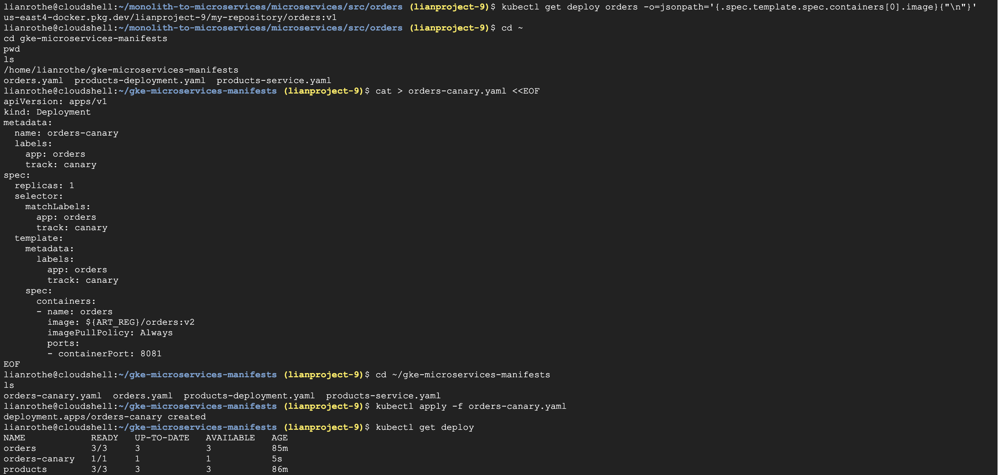
- 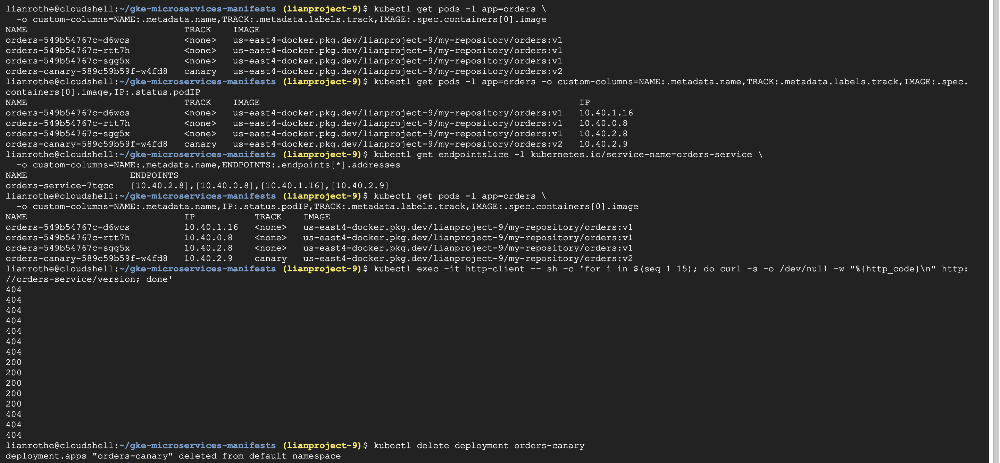
- 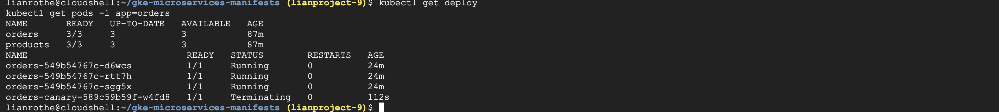
- These commands were done to show a controlled partial rollout. A canary release keeps the stable Deployment running, deploys a second Deployment with the new version, allows the Service to route traffic to both versions, and observes behavior before committing fully. This is done to limit risks by exposing a small portion of traffic to the new release. The file was stored with the Kubernetes manifests in the manifests directory. Then the canary Deployment manifest was created in a way that creates a second Deployment for the same microservice by using the same label, adds a secondary label, and runs only one replica. Since the Service selects Pods by the label it'll load balance requests across stable order Pods and new orders-canary Pods. The canaray Deployment was then applied and confirmed when the three pods with no track label, one pod with track = canary, and the canary pod had the image ending in orders:v2 was displayed. The Kubernetes Service does not route traffic directly to Deployments so it routes traffic to Pod IPs listed in the Service’s EndpointSlice instead. Again, the 200 response shows that the request reached a v2 Pod. These commands and displays shows that Kubernetes Services distribute traffic across all matching Pods, the canary Pod is actively receiving a portion of requests, and only a small subset of traffic reaches the new version. This method is preffered when the goal is to test new behavior safely before committing to a full rollout because it exposes only a subset of traffic to the new version, allows validation under real production load, reduces risk of system-wide failure, and requires monitoring logging or testing to evaluate success.
---
## Task 6
---
- kubectl get deploy orders
- kubectl get svc orders-service
- kubectl get pod http-client
- kubectl exec -it http-client -- sh -c 'for i in $(seq 1 10); do curl -s -o /dev/null -w "%{http_code}\n" http://orders-service/version; done'
- kubectl patch deployment orders -p '{"spec":{"template":{"metadata":{"labels":{"track":"blue"}}}}}'
- kubectl rollout restart deployment/orders
- kubectl rollout status deployment/orders
- kubectl get pods -l app=orders \
  -o custom-columns=NAME:.metadata.name,TRACK:.metadata.labels.track,IMAGE:.spec.containers[0].image
- kubectl patch svc orders-service -p '{"spec":{"selector":{"app":"orders","track":"blue"}}}'
- kubectl get svc orders-service -o=jsonpath='{.spec.selector}{"\n"}'
- kubectl exec -it http-client -- sh -c 'for i in $(seq 1 10); do curl -s -o /dev/null -w "%{http_code}\n" http://orders-service/version; done'
- cd ~/gke-microservices-manifests
- pwd
- ls
- cat > orders-green.yaml <<EOF
- kubectl apply -f orders-green.yaml
- kubectl rollout status deployment/orders-green
- kubectl get pods -l app=orders \
  -o custom-columns=NAME:.metadata.name,TRACK:.metadata.labels.track,IMAGE:.spec.containers[0].image
- kubectl exec -it http-client -- sh -c 'for i in $(seq 1 10); do curl -s -o /dev/null -w "%{http_code}\n" http://orders-service/version; done'
- kubectl patch svc orders-service -p '{"spec":{"selector":{"app":"orders","track":"green"}}}'
- kubectl get svc orders-service -o=jsonpath='{.spec.selector}{"\n"}'
- kubectl exec -it http-client -- sh -c 'for i in $(seq 1 10); do curl -s -o /dev/null -w "%{http_code}\n" http://orders-service/version; done'
- kubectl exec -it http-client -- curl -s http://orders-service/version
- kubectl patch svc orders-service -p '{"spec":{"selector":{"app":"orders","track":"blue"}}}'
- kubectl exec -it http-client -- sh -c 'for i in $(seq 1 10); do curl -s -o /dev/null -w "%{http_code}\n" http://orders-service/version; done'
- kubectl delete deployment orders-green
- kubectl get pods -l app=orders \
  -o custom-columns=NAME:.metadata.name,TRACK:.metadata.labels.track,IMAGE:.spec.containers[0].image
- 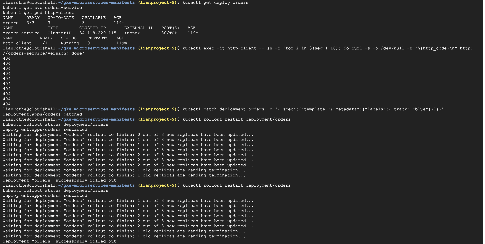
- 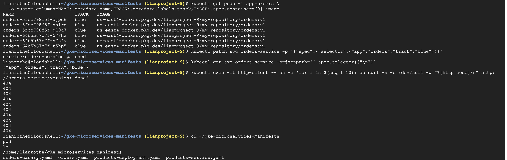
- 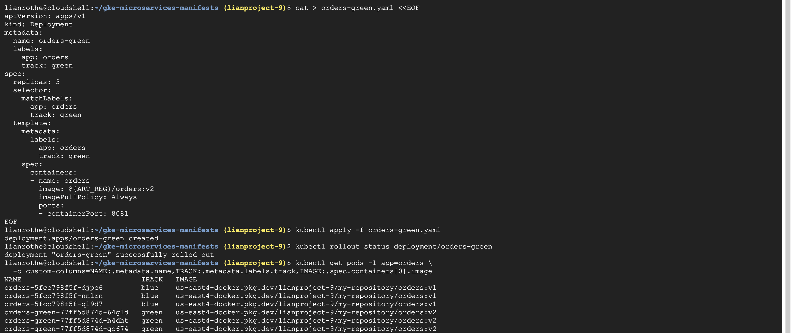
- 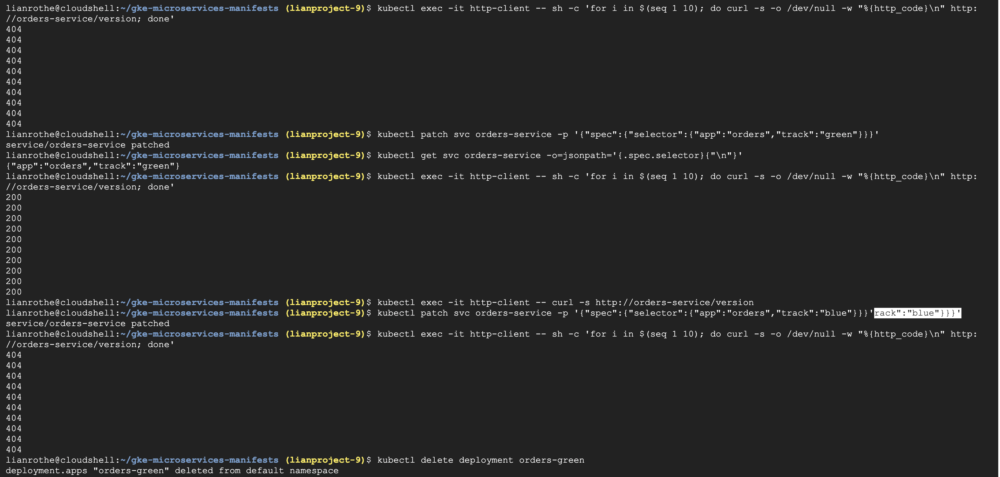
- 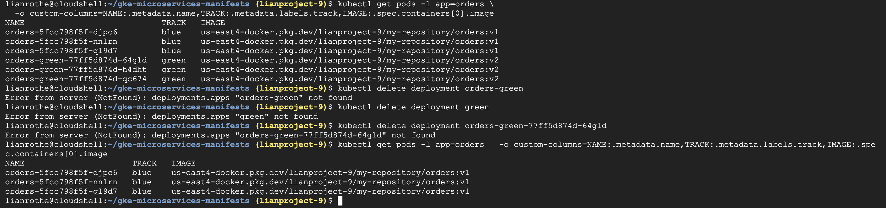
- These commands ran a blue-green deployment which runs two environments in parallel, blue (existing) that is the current running production environment and green (separate) that is the new candidate environment. Once all the checks showed that the baseline was up correctly, the exisiting Deployment is converted to blue. Once three Pods had track = blue, it was made explicit by updating the Service selector, which is shown by the 404 display. The green deployment was then created that can run the new image (orders:v2), have a different label (track=green), and be fully provisioned (same replica count) before switching traffic. It was shown that both environments exist when three Pods showed track = blue for v1 and three Pods showed track = green for v2. The displayed 404 message was done to show that green was not recieving traffic before it was switched, and was then after switched 200 was returned. Finally, green was rolled back simualting a the debugging process by switchng the Service selector back to Blue. The way that these two environments are set up allows for traffic to be switched by modifying the Service selector. This allows for blue to be the current product version and green to be the new candidate version without interfearing with deployment. This is possible because Kubernetes Service routes traffic only to Pods whose labels match its selector so switching does not restart Pods or modify Deployments. Once the green version is carefully validated the blue line can be removed, freeing up the additional capacity that was being used.
---

what is happening conceptually
what Kubernetes is doing
why the step matters

## Diagrams
Each student must submit four diagrams, one for each deployment strategy:
Rolling Update
Canary Deployment
Blue-Green Deployment
Dark Launch / Parallel Run

Each diagram must show:
Deployments
ReplicaSets
Pods
Service
Client Pod
Traffic flow

## Reflection
when each deployment strategy is appropriate
what risks it addresses
how it supports independent microservice deployment
